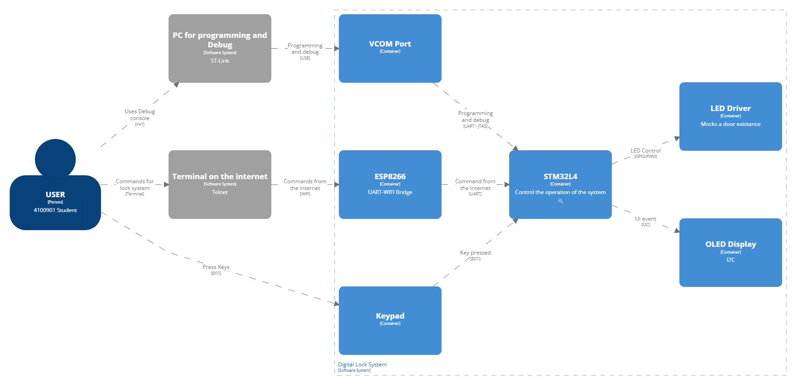
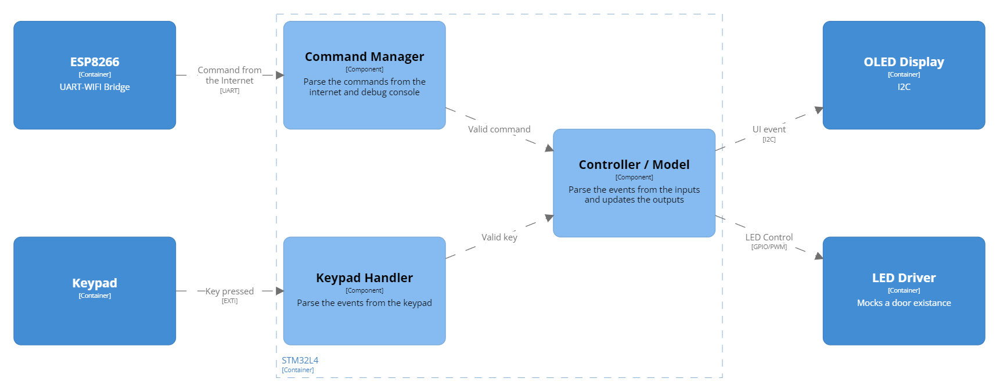
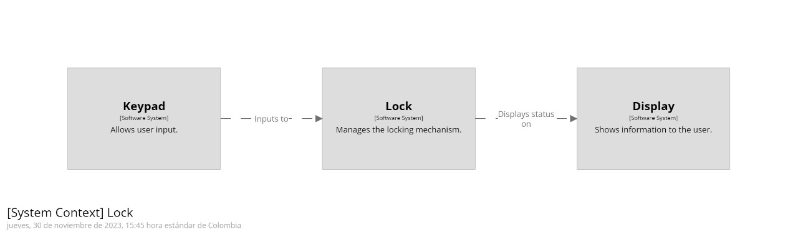

# C4Model

## Context Diagram
The user can prompt the digital lock system either by using:
1. The debug terminal from a host PC through the ST-Link COM port.
2. The hex keypad for password related transactions.
3. The internet over WIFI.

## Container Diagram
The lock system features an STM32L4 as the main processor and an [ESP8266](https://www.espressif.com/en/products/socs/esp8266) as an auxiliar for conenction with the internet (see [ESP-Link](https://github.com/jeelabs/esp-link)). The STM32 controls a hex keypad, a VCOM port for debug, an OLED display for GUI, and an LED for mocking the actuator of the lock system.

## Component Diagram
The STM32 runs a [controller-model-view](https://en.wikipedia.org/wiki/Model%E2%80%93view%E2%80%93controller) pattern in which the controller captures the events from the keypad as well as the commands from the internet, then the model processes the events and updates the view accordingly.

## Code Diagram
The diagram presents the fundamental architecture of a digital lock system, comprising three key components:

1. Keypad: Allows user input, such as number sequences or commands to operate the lock.
2. Lock: Serves as the system's core, responsible for managing the locking mechanism based on the inputs received.
3. Display: Exhibits pertinent information to the user, including the lock's status and feedback messages for confirmation or errors.

Interactions between these components are unidirectional, where the keypad sends data to the lock, which in turn communicates the status to the display. This diagram offers a system context view, outlining the high-level relationships and interactions.
